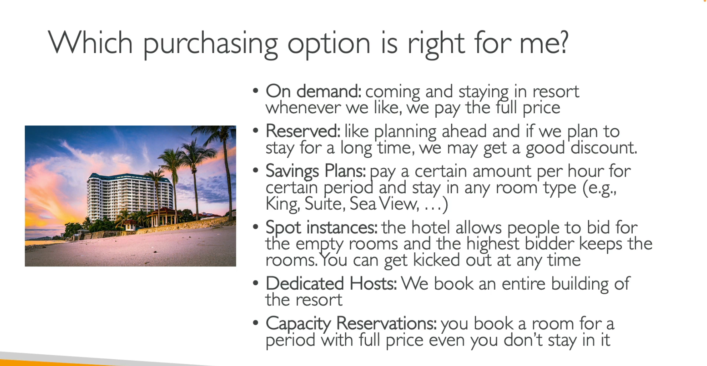

EC2 Instances Purchasing Options
- On-demand instances: short workload, predictable pricing, pay by second
- Reserved (1-3 years): 
    - Reserved Instances long workloads
    - Convertible Reserved Instances - long workloads with flexible instances
- Saving plans (1-3 years) - commitment to an amount of usage, long workload. more modern. you dont commit to a specific instance type but specificamount of usage in dollars, but
- Spot instances: short workloads, cheap, can lose instances (less reliable)
- Dedicated Hosts - book an entire pyhisal server, control instance placement
- Dedicated Instances - no other customers will share your hardware
- Capacity Reservations - reserve a capacity in a specific AZ for any duration

EC2 on Demand:
pay for what you use. 
Linux or Windows - billing per second, after the first minute
other os - billing per hour
Highest cost but no upfront payment
no long term commitment
recommended for short term and un-interrupted workloads where you cant predict how the application will behave

EC2 Reserved Instances:
up to 72 percent compared to on demand. 
reserve specific instance attribute (instance type, region, tenancy, os)
reservation period: 1 year (+discount) 3 years (+++discount)
payment options - no upfront, partial upfront, all upfront
reserved instance's scope - regional or zonal
recommended for steady-state usage apps (think databes)
you can buy and sell in the reserved instance marketplace

-Convertible Reserved instance - can change the ec2 type, instance family, os, scope and tenancy / up to 66 discount       

EC2 Saving Plans:
get discount based on long term usage
commit to a certain type of usage
usage beyond ec2 savings plans in billed at the on demand price
locked to a specific instance family and aws region
flexible: instance size, os, tenancy

EC2 Spot Instances:
most discount - up to 90 compared to on demand
instances you can lose at any point if your max price is less than the current spot price
most cost efficient instances in aws
useful to workloads that are resilient to failure: batch jobs, data analysis, image processing, any distrubed workloads, workloads with a flexible start and end time
Not suitable for crtical jobs or databases

EC2 Dedicated Hosts:
physical server with ec2 instance capacity fully dedicated to your user
allows you address compliance requirements and use your existing server-bound software licences
Purchasing options: on demand (pay for second for active dedicated host) / reserved (1 or 3 years, no upfront, partial upfront, all upfront)
most expensive
useful for software that have complicated licensing model (BYOL - bring your own license)
or for companies that have strong regulatory or compliance needs

Dedicated Instances:
instances run on hardware thats dedicated to you
may share hardware with other instances in same account
no control over instace placement

EC2 Capacity Reservations:
reserve on demand instances capacity in a specific az for any duration
you always have access to ec2 capacity when you need it 
no time commitment, no billing discount
combine with regional reserved instances and savings plans to benefit from billing discounts 
your charged at on demand rate whether you run instances or Not
suitable for short term, uninterrupted workloads that need to be in a specific az

